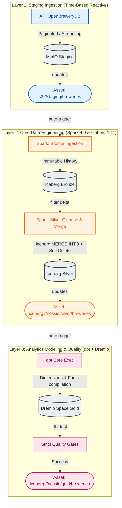

# Data Lakehouse Engineering Manual (v3.1.0)

> **Core Stack:** Airflow 3.2.1 | Spark 4.0.0 | Apache Iceberg 1.11.0 | Project Nessie 0.107.5 | dbt Core 1.8.x | Dremio

---

This project implements a **production-ready, fully reactive, and completely idempotent Data Lakehouse** engineered under the **Medallion Architecture** pattern. The pipeline ingests real-world brewery data from the [OpenBreweryDB API](https://www.openbrewerydb.org/), orchestrates event-driven processing using **Apache Airflow 3.2.1**, cleans and unifies datasets via **Apache Spark 4.0.0** (natively compiled with Scala 2.13), manages transactional table states using **Apache Iceberg 1.11.0**, tracks historical lineage and catalogs via **Project Nessie 0.107.5** (providing Git-like semantics), and builds the analytics-ready Gold dimensional model inside **Dremio** using **dbt Core**.

---

## 🏗️ Data Flow & Reactive (Asset-Aware) Architecture

Unlike legacy monolithic pipelines scheduled using arbitrary Cron expressions, this lakehouse adopts **Reactive Asset-Aware Orchestration** (natively introduced in **Airflow 3.x**). The pipelines are decoupled into three isolated DAGs that react dynamically to the physical arrival of data in S3 (MinIO) and state updates in the Nessie Catalog.



---

## 💎 Deep-Dive Engineering Principles & Processes

### 1. Ingestion (Staging Layer)
The ingestion script (`src/staging/fetch_breweries.py`) executes paginated scans against the OpenBreweryDB API.
*   **OOM (Out-of-Memory) Prevention:** To prevent memory exhaustion on the Airflow worker nodes, data is ingested in sequential pages (from 50 to 200 records).
*   **In-Memory S3 Streaming:** Each API page is serialized in memory and directly streamed to MinIO using the native MinIO client's low-overhead `put_object` call. This eliminates disk I/O bottlenecks in the container by avoiding temporary local writes.
*   **Partition Mapping:** Saved under the path layout `s3://staging/breweries/{execution_date}/breweries_page_{page}.json`.

### 2. History Preservation (Bronze Layer)
The Bronze ingestion task (`src/bronze/ingest_breweries.py`) reads the daily raw staging JSON files and appends them to a structured Apache Iceberg table:
*   **Absolute Immutability:** The Bronze table operates strictly in **Append-Only** mode (`.append()`), functioning as our historical audit trail and immutable source of truth.
*   **Technical Enrichment:** Rows are enriched with runtime metadata: `ingested_at` (UTC timestamp) and `ingestion_date` (logical processing partition).
*   **Iceberg Format-Version 2:** Configured explicitly with `format-version = 2` to support row-level deletes natively for downstream operations and GDPR/auditing requirements.
*   **Partitioning Strategy:** Partitioned logically by the `ingestion_date` column, enabling Spark to perform *partition pruning* (scanning only the new daily arrival instead of full historical scans).

### 3. Cleaning, Deduplication & Atomic MERGE (Silver Layer)
The Silver layer transformation (`src/silver/transform_breweries.py`) represents the core business logic, executing three critical operations:

#### A. Unicode Translation & Null Handling (Zero Python UDFs)
Python UDFs (User-Defined Functions) throttle distributed Spark execution because they require serializing data from the JVM to an external Python process.  
To prevent this bottleneck, character normalization (such as accent removal for international data) is performed using the JVM-native **`F.translate()`** function:
```python
# Executed entirely within Spark's JVM core, bypassing serialization overhead
accents = "áàâãäéèêëíìîïóòôõöúùûüçÁÀÂÃÄÉÈÊËÍÌÎÏÓÒÔÕÖÚÙÛÜÇ"
clean   = "aaaaaeeeeiiiiooooouuuucAAAAAEEEEIIIIOOOOOUUUUC"
df = df.withColumn("state", F.translate(F.col("state"), accents, clean))
```
Additionally, null geographical values (`state`) are dynamically replaced with a sentinel value (`__UNKNOWN__`), preventing Iceberg from writing orphaned directory structures on disk.

#### B. High-Performance Deduplication
If duplicate records exist across API pages within a single ingestion, we apply a strict analytical Window function on the business key (`id`), keeping only the most recent state by sorting on the technical timestamp (`ingested_at`):
```python
window = Window.partitionBy("id").orderBy(F.col("ingested_at").desc())
df = df.withColumn("_rn", F.row_number().over(window)).filter(F.col("_rn") == 1).drop("_rn")
```

#### C. Atomic MERGE with Soft Delete (Iceberg Transaction)
The Silver layer is synchronized via a single atomic Apache Iceberg transaction (`MERGE INTO`). Since the API provides the full catalog of active breweries, any record in our historical target table that **is not matched** by today's source batch has been deleted from the origin system.

We utilize the advanced **`WHEN NOT MATCHED BY SOURCE`** clause to flag and execute *soft deletes* at the database level in a single pass, updating the `is_active` flag:
```sql
MERGE INTO nessie.silver.breweries t
USING v_transformed_breweries s
ON t.id = s.id
WHEN MATCHED THEN
    UPDATE SET
        t.name = s.name,
        t.brewery_type = s.brewery_type,
        t.address_1 = s.address_1,
        t.city = s.city,
        t.state = s.state,
        t.country = s.country,
        t.is_active = true,
        t.updated_at = current_timestamp()
WHEN NOT MATCHED THEN
    INSERT (id, name, brewery_type, address_1, city, state, country, is_active, updated_at, ingestion_date)
    VALUES (s.id, s.name, s.brewery_type, s.address_1, s.city, s.state, s.country, true, current_timestamp(), s.ingestion_date)
WHEN NOT MATCHED BY SOURCE THEN
    UPDATE SET
        t.is_active = false,
        t.updated_at = current_timestamp()
```

### 4. Dimensional Modeling (Gold Layer)
The Gold analytics layer serves downstream business intelligence and reporting.
*   **Dremio Query Virtualization:** Dremio connects directly to the Nessie catalog, acting as our high-performance Ad-hoc SQL execution engine.
*   **dbt Core Modeling:** dbt compiles and models datasets incrementally within Dremio spaces:
    *   **Dimensions:** `dim_locations` and `dim_brewery_types` (materialized as **views** — fast to rebuild, derived directly from `stg_silver_breweries`).
    *   **Facts:** `fact_breweries` — materialized as an **incremental table** with `merge` strategy on `brewery_key`, so only deltas after the last `updated_at` are processed.
    *   **Marts:** `mart_brewery_coverage` — materialized as a **table** for fast BI consumption.
    *   **Seeds:** `brewery_type_mapping.csv` — canonical list of the 10 OpenBreweryDB types; a `relationships` test on `dim_brewery_types` blocks unknown values from reaching Gold.
    *   **Macros:** `surrogate_key(fields)` — normalizes via `UPPER(TRIM(COALESCE(field, '')))` and emits `MD5(field1 || '|' || ...)`. Used by both dimensions.
    *   **Snapshot:** `snap_breweries` — timestamp-based snapshot on Silver's `updated_at`, producing `dbt_valid_from`/`dbt_valid_to` for point-in-time queries.
*   **Strict Quality Gates:** We enforce strict data quality validations (`not_null`, `unique`, and foreign key referential integrity) via dbt test gates. The output analytical Asset is only updated if all quality checks pass.

### 5. Bronze Table Schema (Reference)
The Bronze table preserves every field returned by the OpenBreweryDB API plus two ingestion metadata columns:

| Column | Type | Source |
| :--- | :--- | :--- |
| `id` | STRING | API |
| `name` | STRING | API |
| `brewery_type` | STRING | API |
| `address_1`, `address_2`, `address_3` | STRING | API |
| `city`, `state_province`, `state`, `country` | STRING | API |
| `postal_code`, `street`, `phone`, `website_url` | STRING | API |
| `longitude`, `latitude` | DOUBLE | API |
| `ingestion_date` | STRING (YYYY-MM-DD) | injected — partition key |
| `ingested_at` | TIMESTAMP (UTC) | injected — `F.current_timestamp()` |

The Silver layer trims this down to the analytical subset (`id`, `name`, `brewery_type`, `address_1`, `city`, `state`, `country`, `is_active`, `updated_at`, `ingestion_date`) and is **partitioned by `state`**, which speeds up Gold queries that filter or aggregate by geography.

### 6. Auto-Provisioning of Services
Two pieces of plumbing make the stack work out of the box without manual UI clicks:

*   **Dremio sources** (`docker/dremio/setup_sources.sh`): runs once via the `dremio-setup` container after Dremio becomes healthy. Registers the Nessie catalog and the MinIO `warehouse` bucket as Dremio sources, so dbt can immediately query `lakehouse.silver.breweries` and write into the `gold` space.
*   **Airflow Spark connection** (`plugins/create_spark_connection.py`): a startup-time Airflow plugin that creates the `spark_docker` connection (pointing at `spark://spark-master:7077`) in the Airflow metadata DB if it doesn't already exist. The DAGs reference this connection via `conn_id="spark_docker"` — no need to add it manually through the Airflow UI.

---

## 🔒 Git-Like Version Control for Data (Project Nessie)

**Project Nessie** acts as our transactional catalog server, hosting metadata at `http://localhost:19120`.

```
         (main) ─── Daily production data flow (Stable, verified states)
            │
            └─── [Create Branch: dbt_dev] ─── Transform, test and validate in isolation
                                                 │
                                                 └─── [Atomic Merge to Main] (Zero-Copy)
```

### Key Engineering Benefits:
*   **Absolute Isolation:** Developing on a dedicated branch (e.g., `dbt_dev`) ensures that bulk transformations do not impact stable operational tables queried by BI tools on `main`.
*   **Zero-Copy Cloning:** Branch creation duplicates metadata pointers only. No physical files are cloned in S3/MinIO, keeping compute costs and storage overhead at zero.
*   **Instant Rollbacks:** If a pipeline corrupts a table or fails a data quality gate, the database catalog can be instantly rolled back to the hash of the last-known healthy commit.

### Spark Catalog Configuration:
Nessie is integrated using Iceberg's native `NessieCatalog` implementation, eliminating the need for redundant external jars:
```python
# Register the Nessie Catalog on SparkSession initialization
.config("spark.sql.catalog.nessie", "org.apache.iceberg.spark.SparkCatalog")
.config("spark.sql.catalog.nessie.catalog-impl", "org.apache.iceberg.nessie.NessieCatalog")
.config("spark.sql.catalog.nessie.uri", "http://nessie:19120/api/v2")
.config("spark.sql.catalog.nessie.ref", "main")
.config("spark.sql.catalog.nessie.io-impl", "org.apache.iceberg.hadoop.HadoopFileIO")
```

---

## 🛠️ Classpath Architecture & Compatibility (Spark 4.0 + AWS SDK v2)

Upgrading the core data processing engine to **Apache Spark 4.0.0** and **Hadoop 3.4.1** required a precise re-alignment of classpath configurations:

1.  **Migration to AWS SDK for Java v2:**  
    Hadoop 3.4.1's `hadoop-aws` module has abandoned the legacy AWS SDK v1 (`aws-java-sdk-bundle`) in favor of the modern AWS SDK for Java v2. We resolved runtime dependency conflicts by bundling the modern Amazon Web Services fat-jar:
    *   **Hadoop S3 Connector:** `org.apache.hadoop:hadoop-aws:3.4.1`
    *   **AWS SDK v2 Bundle:** `software.amazon.awssdk:bundle:2.24.6`
    *   *Engineering Note:* Mixing legacy v1 classpaths or bundle jars will cause classpath crashes in the Spark Catalyst Optimizer.
2.  **Classpath Optimization:**  
    Nessie's catalog connector is natively bundled inside the Iceberg Spark runtime fat-jar (`iceberg-spark-runtime-4.0_2.13-1.11.0.jar`). To prevent classpath bloat and download failures during builds, we **removed the redundant `nessie-spark-extensions` jar**, simplifying our runtime footprint.

---

## ⚙️ Airflow 3.x Architectural Decisions

Apache Airflow 3.x introduced several breaking architectural changes that required specific engineering solutions in this project:

### 1. Decoupled DAG Processor (Standalone Service)
In Airflow 3.x, the **Scheduler no longer parses DAG files**. DAG file discovery, parsing, and serialization into the metadata database have been fully extracted into a dedicated standalone service called the **DAG Processor**. Without this service running, no DAGs will appear in the UI.

Our Docker Compose topology includes this service explicitly:
```yaml
dag-processor:
  <<: *airflow-common
  command: dag-processor
```

### 2. Dynamic Credential Management (Simple Auth Manager)
Airflow 3.x replaced the legacy Flask AppBuilder (FAB) authentication system with the **Simple Auth Manager**. This manager reads credentials from a JSON file on disk, not from the database.

Our solution generates this file **dynamically at container startup** using the `AIRFLOW_USER` and `AIRFLOW_PASSWORD` variables from the `.env` file. The generated credentials file is written to `/opt/airflow/simple_auth_passwords.json` — a container-internal path that is **never mounted to the host filesystem**, ensuring no credential files leak into the project directory or version control.

To change the Airflow UI login credentials, simply edit the `.env` file and run `make up`:
```env
AIRFLOW_USER=your_username
AIRFLOW_PASSWORD=your_password
```

### 3. API Server (Webserver Replacement)
The legacy `airflow webserver` command was removed in Airflow 3.x. The modern replacement is `airflow api-server`, which serves both the UI and the FastAPI-based REST API on port `8080`.

---

## 🚀 How to Run & Validate

### 1. Initialize the Local Environment (`uv`)
We use Astral's fast package manager `uv` to compile and sync Python dependencies in under 10 seconds:
```bash
# Compile virtual environment and install packages
uv venv --python 3.12
uv pip install -e .[dev,airflow]
```

### 2. Configure Environment & Cryptography Keys
Before spinning up Docker, copy environment files and generate secrets:
```bash
cp .env.example .env
cp airflow.env.example airflow.env

# Generate keys and insert them into the corresponding variables in airflow.env
make fernet-key
make webserver-key
```

### 3. Spin Up Docker Infrastructure
The project Makefile wraps all Docker CLI complexities. Build and launch all services with:
```bash
make up
```

This command provisions the following **10 services** in our isolated bridge network (`lakehouse`):

| Service | Description |
| :--- | :--- |
| **MinIO** | S3-compatible object storage with pre-configured `staging` and `warehouse` buckets |
| **PostgreSQL** | Airflow metadata store (internal credentials, isolated from UI login) |
| **Nessie** | Iceberg REST Catalog Server with Git-like versioning semantics |
| **Spark Master** | Distributed processing coordinator |
| **Spark Worker** | Execution node connected to Spark Master (2 cores, 2GB RAM) |
| **Airflow Scheduler** | Task scheduling engine (decoupled from DAG parsing in Airflow 3.x) |
| **Airflow DAG Processor** | Standalone DAG file parser and serializer (new in Airflow 3.x) |
| **Airflow API Server** | Web UI and REST API (replaces legacy `webserver` command) |
| **Dremio** | SQL query virtualization engine, pre-wired to Nessie and MinIO |
| **Dremio Provisioner** | One-shot setup container that registers Nessie/MinIO sources in Dremio |

### 4. Port Mapping & Monitoring UIs

You can access and monitor the active nodes and service consoles using the following local endpoints:

| Service | Local URL | Default Credentials |
| :--- | :--- | :--- |
| **Airflow 3 UI** | [http://localhost:8080](http://localhost:8080) | Configured via `.env` (`AIRFLOW_USER` / `AIRFLOW_PASSWORD`) |
| **MinIO Console** | [http://localhost:9001](http://localhost:9001) | `admin` / `password` |
| **Nessie Admin UI** | [http://localhost:19120](http://localhost:19120) | Public Access (Read/Write) |
| **Dremio Console** | [http://localhost:9047](http://localhost:9047) | `dremio_admin` / `dremio123` |
| **Spark Master UI** | [http://localhost:9090](http://localhost:9090) | Master status dashboard |

### 5. Available Makefile Commands

| Command | Description |
| :--- | :--- |
| `make up` | Build images and start all services |
| `make down` | Stop all services and remove volumes |
| `make restart` | Restart all running services |
| `make logs` | Tail logs for all services |
| `make logs-airflow` | Tail Airflow scheduler logs |
| `make logs-spark` | Tail Spark master logs |
| `make test` | Run unit tests with coverage report |
| `make lint` | Run Ruff linter on all Python code |
| `make fmt` | Auto-format all Python code with Ruff |
| `make clean` | Remove `__pycache__`, `.pytest_cache`, and coverage artifacts |
| `make fernet-key` | Generate a new Fernet encryption key for Airflow |
| `make webserver-key` | Generate a new secret key for the Airflow API server |
| `make help` | List all available commands |

---

## 🧪 Code Quality & Unit Testing
We enforce code hygiene and PEP8 standards using **Ruff** and **pytest**:
```bash
# Run unit tests (mocks API endpoints and MinIO writes)
make test

# Auto-format all Python scripts
make fmt

# Run static linter and syntax checks
make lint
```

---

## 📁 Project Structure

```
data_lake/
├── dags/                          # Airflow DAG definitions (3 reactive DAGs)
│   ├── staging_ingestion.py       # Layer 1: API ingestion (daily schedule)
│   ├── bronze_silver_processing.py # Layer 2: Spark Bronze + Silver (asset-triggered)
│   └── gold_dbt_processing.py     # Layer 3: dbt Gold modeling (asset-triggered)
├── src/                           # Core Python business logic
│   ├── staging/                   # API fetch & S3 streaming
│   ├── bronze/                    # Iceberg append-only ingestion
│   ├── silver/                    # MERGE INTO + soft delete transforms
│   └── utils/                     # Shared Spark session factory & configs
├── dbt_project/                   # dbt Core project (Gold layer on Dremio)
├── docker/                        # Dockerfiles & provisioning scripts
│   ├── Dockerfile.spark           # Spark 4.0.0 + Iceberg + AWS SDK v2
│   ├── Dockerfile.airflow         # Airflow 3.2.1 + PySpark + dbt
│   └── dremio/                    # Dremio source setup scripts
├── tests/                         # Unit tests (pytest + mocks)
├── docker-compose.yml             # 10-service orchestration topology
├── Makefile                       # Developer CLI shortcuts
├── pyproject.toml                 # Python dependencies (uv/pip compatible)
├── .env.example                   # Environment variable template
├── airflow.env.example            # Airflow-specific configuration template
└── .gitignore                     # Git exclusions (env files, venvs, dbt artifacts)
```

---

## 📄 License
This advanced engineering project is licensed under the MIT License.
